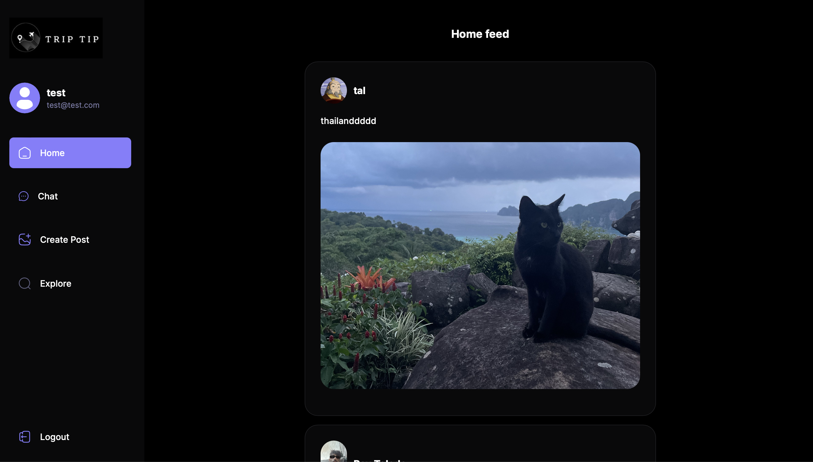

<a name="readme-top"></a>

<div align="center">
  
  <p align="center">Social network for travle</p>
  <a href="https://www.canva.com/design/DAF_fSTJNeY/o09m47NuVXMu0VyJdNaTVA/view?utm_content=DAF_fSTJNeY&utm_campaign=designshare&utm_medium=link&utm_source=editor">Overview Video</a>
</div>
<br/>

## Clone the repos
To run the web you need to clone this repository using the following url in the VCS:

   ```sh
   https://github.com/YanivRabin/TripTip-web-app-backend.git
   ```
<p align="right"><a href="#readme-top">back to top</a></p>


## Setup
After cloning the repos you need to open the terminal on each one and npm install to download all the packages:

   ```sh
   npm install
   ```
<p align="right"><a href="#readme-top">back to top</a></p>

Now you should create a .env file with the next fromat:
<br /><br />
DATABASE_URL='mongodb://[your data base]'<br />
PORT=3000<br />
JWT_SECRET=[your secret]<br />
JWT_REFRESH_SECRET=[your refresh secrete]<br />
JWT_EXPIRATION=3h<br />
GOOGLE_CLIENT_ID=[google ouath key]<br />
GOOGLE_API_KEY=[google api key]<br />

## Run the web

To run the web you should run the follow commands in the terminal:
   ```sh
   npm run start
   ```
<p align="right"><a href="#readme-top">back to top</a></p>


Now on the web you should enter in the url:
```sh
http://localhost:3000
   ```
<p align="right"><a href="#readme-top">back to top</a></p>

## Docs
If you want to see the Swagger docs you should enter in the url:
```sh
http://localhost:3000/api-docs
   ```
<p align="right"><a href="#readme-top">back to top</a></p>


<br/>
<br/>
<br/>


